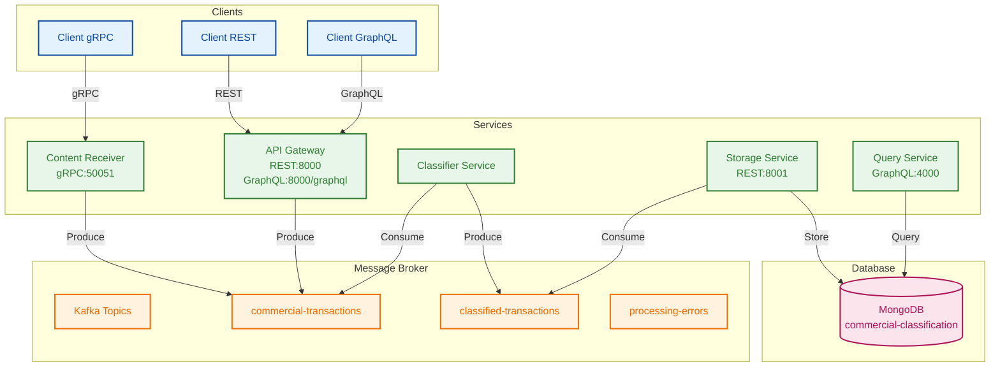

# Commercial Pipeline - Architecture de Traitement des Transactions

Ce projet est une architecture distribuée pour le traitement des transactions commerciales, utilisant gRPC, Kafka, REST, et GraphQL.

## Architecture



## Composants

### Services

- **Content Receiver** (Port 50051) : Service gRPC pour la réception des transactions
- **API Gateway** (Port 8000) : Point d'entrée REST et GraphQL
- **Classifier Service** : Service de classification des transactions
- **Storage Service** (Port 8001) : Service de stockage des transactions
- **Query Service** (Port 4000) : Service de requêtes GraphQL

### Message Broker

- **Kafka** (Port 9092) : Topics principaux :
  - commercial-transactions
  - classified-transactions
  - processing-errors

### Base de données

- **MongoDB** (Port 27017) : Base de données commercial-classification

## Prérequis

- Node.js (v14 ou supérieur)
- Kafka (v2.13 ou supérieur)
- MongoDB (v4.4 ou supérieur)
- Postman (pour les tests)

## Installation

1. **Cloner le projet**

```bash
git clone [URL_DU_REPO]
cd commercial-pipeline
```

2. **Installer les dépendances**

```bash
# Pour chaque service
cd content-receiver && npm install
cd ../api-gateway && npm install
cd ../classifier-service && npm install
cd ../storage-service && npm install
cd ../query-service && npm install
```

3. **Configurer Kafka**

```bash
# Démarrer Zookeeper
bin/zookeeper-server-start.sh config/zookeeper.properties

# Démarrer Kafka
bin/kafka-server-start.sh config/server.properties
```

4. **Configurer MongoDB**

```bash
# Démarrer MongoDB
mongod --dbpath /path/to/data/db
```

## Démarrage des Services

1. **Content Receiver**

```bash
cd content-receiver
npm start
```

2. **API Gateway**

```bash
cd api-gateway
npm start
```

3. **Classifier Service**

```bash
cd classifier-service
npm start
```

4. **Storage Service**

```bash
cd storage-service
npm start
```

5. **Query Service**

```bash
cd query-service
npm start
```

## Test avec Postman

### Test gRPC

1. Ouvrir Postman
2. Créer une nouvelle requête gRPC
3. URL : `grpc://localhost:50051`
4. Importer le fichier proto : `content_receiver.proto`
5. Exemple de requête :

```json
{
  "transaction_id": "TRX123",
  "client_id": "CLIENT001",
  "montant": 1500.5,
  "produit": "Produit A",
  "type_paiement": "CARTE",
  "lieu": "Paris",
  "date": "2024-05-15T10:00:00Z",
  "metadata": {
    "categorie": "commerce",
    "priorite": "normale"
  }
}
```

### Test REST

1. Méthode : POST
2. URL : `http://localhost:8000/api/transactions`
3. Headers : `Content-Type: application/json`
4. Body : Même format que la requête gRPC

### Test GraphQL

1. URL : `http://localhost:8000/graphql`
2. Exemple de requête :

```graphql
query {
  transactions(
    client_id: "CLIENT001"
    startDate: "2024-05-01"
    endDate: "2024-05-31"
  ) {
    transaction_id
    client_id
    montant
    classifications
  }
}
```

## Structure des Données

### Transaction

```json
{
  "transaction_id": "string",
  "client_id": "string",
  "montant": "number",
  "produit": "string",
  "type_paiement": "string",
  "lieu": "string",
  "date": "string",
  "metadata": {
    "key": "value"
  }
}
```

## Contribution

1. Fork le projet
2. Créer une branche (`git checkout -b feature/AmazingFeature`)
3. Commit les changements (`git commit -m 'Add some AmazingFeature'`)
4. Push vers la branche (`git push origin feature/AmazingFeature`)
5. Ouvrir une Pull Request

## Licence

Ce projet est sous licence MIT. Voir le fichier `LICENSE` pour plus de détails.
